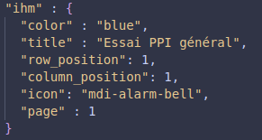

# 0. Remerciements

\clearpage
# 1. Introduction

&nbsp;&nbsp;&nbsp;&nbsp;Dans le cadre de la 1ère année de mon cycle Ingénieure en Génie Informatique à **Cy-Tech**, j'ai réalisé un stage de 10 semaines (du 12 Juin au 1 Septembre 2023) au sein du **BE**[^4] d' **Ae&t**, signifiant Application Electronique et Techniques, à Jurançon. J'ai eu vent de cette opportunité via le career center de Cy-Tech et ai choisi de faire une demande de stage à ae&t pour de nombreuses raisons. J'avais d'abord l'envie de découvrir le monde professionel dans le **développement logiciel**. Ensuite, cette expérience était l'occasion d'utiliser toutes les connaissances et compétences que j'ai pu apprendre depuis ces dernières années afin de réaliser un objectif concret. Enfin, la possibilité de travailler pour une entreprise local et historique de Pau et sa périphérie m'a d'autant plus motivé.    
&nbsp;

&nbsp;&nbsp;&nbsp;&nbsp;Je vais tout d'abord vous présenter dans ce rapport l'entreprise qui m'a accueilli et l'équipe avec qui j'ai réalisé mon stage. Suite à quoi je développerai la mission qui m'a été confié et son déroulement ainsi que les technologies utilisé et conclurai par un bilan de ces 8 semaines de stage à l'heure de ce rapport. En effet, il reste encore 2 semaines de stage afin de finaliser le projet, la date de rendu de ce rapport étant le 15 Août.  
&nbsp;  

&nbsp;&nbsp;&nbsp;&nbsp;Le but initial de ce stage était la confection **UI/UX** [^1] d'une **IHM** [^2] reconfigurable à l'aide d'un fichier de configuration au format JSON, il évolura par la suite intégrant le développement plus poussé du backend[^3] de l'application avec la gestion des systemes d'alarmes sur le réseau.   

[^1]: **I**nterface **U**tilisateur / e**X**perience **U**tilisateur
[^2]: **I**nterface **H**omme **M**achine
[^3]: partie de l'application devant produire un résultat, en opposition au frontend qui est la partie visible
[^4]: Bureau d'étude

\clearpage

# 2. Ae&t : l'entreprise d'accueil 

## &nbsp;&nbsp;2.1. Qui sont-ils ?

&nbsp;&nbsp;&nbsp;&nbsp;Fondé en 1976 par Robert Joseph, ae&t était a la base une petite entreprise qui vendait des lampes flash dans son garage. Après être parti à la retraite 10 ans plus tard en 1986, son fils, Jean-Yves Joseph, reprit la boite familial et développa en plus des lumières, des systemes d'alarmes dont certains sont conforme à la réglementation ATEX (utilisable en zone explosive). Vous l'aurez compris l'objectif principal d'Ae&t est de signaler et protéger autant les lieux publics comme les écoles et gares que les usines à haut risque !

>**Slogan de Ae&t :**  &nbsp;&nbsp;&nbsp;&nbsp;entre nous, protéger la vie 

&nbsp;&nbsp;&nbsp;&nbsp;L'entreprise est comporte 2 corps principaux : la partie commercial responsable des ventes et de la promotion de ae&t et le bureau d'étude, partie dans laquelle j'ai effectué mon stage, qui est responsable de la conception de nouveaux produits. Cette part est moteur de l'innovation de ae&t et c'est notamment grace à ces innovations que l'entreprise c'est vu décerner de nombreux *trophées de l'innovation* tel que pour Vigisignal en 2011 ou encore le Voxalert AJS1 en 2013.

## &nbsp;&nbsp;2.2. Leurs concurrents

&nbsp;&nbsp;&nbsp;&nbsp;Cependant ils ne sont pas les seules dans ce milieu, de nombreux gros concurrents mondiaux existe au niveau des systèmes de télécommunications d'alerte tel que *Telegraphia* une société Tchécoslovaque, *Ateis* entreprises Française spécialisée dans le public address ou encore *Commend* d'origine Autrichienne.

\clearpage
## &nbsp;&nbsp;2.3. Hauts fait

&nbsp;&nbsp;&nbsp;&nbsp;Ae&t à de nombreux très grands succès à son actif, en effet suite à son expension dans les locaux actuels à Jurançon en 1990, ae&t à reçu de nombreux prix et trophées tel que le trophées des "***AS de l'entreprise en Béarn et Soule***" à 3 reprises! Ils ont aussi décroché de gros contracts tels que la commandes d'alarmes sonores et optiques dans 16 centrales nucléaires EDF, d'alarmes d'évacuation indendie pour le palais des festivals de cannes ou encore la signalisation lumineuse durant les travaux du tunnel sous la Manche et sont responsable, encore à ce jour, du système d'illumination de le Tour Eiffel !

{height=40%}

\clearpage
# 3. Le déroulement du stage

## &nbsp;3.1. La mission

### &nbsp;&nbsp;3.1.1. Le contexte

&nbsp;&nbsp;&nbsp;&nbsp; Un des élements très aimé par les clients d'ae&t est l'AP8, un pupitre de commande des systèmes d'alarmes VIGInet. Totalement configurable, il peut activer/désactiver les alarmes, communiquer des messages vocaux et affiche les différentes erreurs sur les boities d'alarmes! Cependant il souffre de quelques défaut : chaque pièce demande une longue personnalisation éléctronnique et la remonté d'information est très limité, en effet il ne peut transmettre de l'information que par quelques LED comme on peut le voir [ci-dessous](AP8).  

### &nbsp;&nbsp;3.1.2. L'objectif

&nbsp;&nbsp;&nbsp;&nbsp; Nous voila à la raison du stage. L'objectif était le portage de l'AP8 vers une application tablette modulable. Il nous été initialement demandé de développé uniquement une interface graphique intelligente configurable via un fichier de configuration général au format json. Cependant le stage fut assez vite étendu au développement plus complet de l'application avec notamment la communication entre l'application et les boitiers d'alarmes ainsi que la remonté des éventuelles disfonctions des appareils sur le réseaux.  
&nbsp; 

{height=35%}

\clearpage
## &nbsp;&nbsp;3.2. Développement de l'IHM

### &nbsp;&nbsp;3.2.1. Préparation, recherche et compréhension

&nbsp;&nbsp;&nbsp;&nbsp;Notre première 'mission' une fois être arrivé fut de préparé notre environnement de travail, c'est à dire l'installation des différentes applications et versions des technologies dont nous aurions besoin pour la réalisation du stage ([cf annexe sur les outils et technologies](#les-outils-et-technologies-du-projet)).  
&nbsp;

&nbsp;&nbsp;&nbsp;&nbsp;Suite à quoi le plus important avant de ce lancer été de comprendre pronfondement qu'est-ce-que l'AP8 et comment elle marche, d'isoler ses points forts et faibles, son utilité et pourquoi elle plaît autant au client. Il s'agit d'un appareil utilisé qu'en cas dévacuation d'urgence où de quelques test, il faut donc une interface très rapide d'accès et intuitive afin que n'importe qui puisse l'utiliser sans manuel à lire ni formation préalable. De plus, pour ne ré-inventer ce qui existe déja, nous avons aussi regardé sur le marché les différentes alternatives qui existaient chez nos concurrents en tant que sources d'inspiration et afin d'avoir une idée du produit final. L'utilisation de pictogramme était un facteur omniprésent dans la quasi totalité des appareils, permettant d'outre-passé la barrière de la langue.

\clearpage
### &nbsp;&nbsp;3.2.2 Prototypage

&nbsp;&nbsp;&nbsp;&nbsp;Une fois toutes les idées en mémoire et avant de ce lancer tête baissé dans la programmation, nous avons décidé logiquement de commencer par des schéma brouillons sur un [tableau blanc](Tableau-de-brainstorm-et-design) avec toutes les options nécessaires, des idées de design, de fonctionnalités et le degré d'importance de chaqu'un. Tous ce qui nous passé par la tête y était écrit avant d'y trier et garder uniquement ceux que nous trouvions les meilleurs. 
&nbsp;

{height=30%}

&nbsp;&nbsp;&nbsp;&nbsp;Ensuite nous avons développé des prototype de l'interface sur [Figma](#figma), comme vous pouvez le voir ci-dessous, et la présentions régulièrement à notre maitre de stage et certains collègues afin d'avoir le plus de retour constructif possible et d'idée pour ciblé au mieux leurs attentes et leurs besoin pour l'application. 
&nbsp;

{height=30%}

\clearpage
### &nbsp;&nbsp;3.2.3 Développement de l'interface

&nbsp;&nbsp;&nbsp;&nbsp;Après de multiples prototypes, présentation et améliorations nous avions une bonne base pour commencer le developpement de l'interface ainsi que la validation de notre maitre de stage. Nous avons donc récupéré la base d'une autre application d'ae&t afin de construire la notre, de nombreuses methodes et librairy était déjà installer et configurer nous permettant de nous concentrer vraiment sur le développement de l'interface sur [Vue](#vuejs). Pour un gain de temps nous avons rajouté un librairie libre de composents pour Vue nommé Vuetify permettant de construire des boutons, des icons, des transitions et bien d'autres. Cependant cela ne serait que temporaire étant donnée que cela pouvait poser problème si Vuetify évolué et pouvait potentiellement entrer en conflit avec d'autre technologies utilisé par l'entreprise comme UnoCSS[^unocss] mais cela nous permettait d'avoir une promesse de rendu d'une interface fonctionnel.  
&nbsp;

&nbsp;&nbsp;&nbsp;&nbsp;Une fois l'interface bien avancé, j'ai quitté le développement de la partie visible de l'interface pour me consacrer à la lecture et l'interpretation du fichier de configuration afin de rendre l'interface autonome pendant que Aya finisait la partie avec Vuetify puis faisait le portage sans Vuetify. Pour cela j'ai du me familiariser avec des **patrons de conception**[^designPattern] tel que Factory, Singleton et Strategy qui ne sont vu qu'en 2ème année d'ingénieur a CY-Tech mais énormement utilisé dans le développement applicatif. Une fois cela fait j'ai pu ajouté mes propre clés:valeurs au document de configuration JSON et les transmettre à la partie visuel de l'application afin qu'elle puisse positionner automatiquement les boutons d'alertes au bon endroit avec la bonne couleurs, logo et texte. 

{height=20%}

[^unocss]: UnoCSS est un framework CSS inspiré par WindiCSS tailWind CSS et Twind mais qui n'a pas besoin pas de re-parcourir le code pour fonctionner et est donc bien plus rapide
[^designPattern]: Aussi appelé design pattern est la meilleure solution connue à un problème de conception récurrent.

\clearpage

## &nbsp;&nbsp;3.3. Extension de la mission

&nbsp;&nbsp;&nbsp;&nbsp;Une fois la lecture du fichier du fichier opérationnel j'ai commencé à regarder comment l'AP8 faisait pour communiquer avec le système d'alarmes à l'impulsion d'un button, cependant tous le code était en C++ et donc non réutilisable sur notre application. Heureusement pour nous, notre maître de stage avait déja commencé le portage de cette partie en NodeJS et a su trouver le temps pour nous expliquer en détails comment le système Viginet communique entre ses différents composents, et par extension, comment notre application devait communiquer avec les armoires d'alarmes.

### &nbsp;&nbsp;3.3.1. Le système de d'alarme

&nbsp;&nbsp;&nbsp;&nbsp;Pour le déclenchement des alarmes, il nous fallait envoyer des trames[^trames] très précise via [Mqtt](#mqtt) lorsqu'un button était appuyé sur l'interface. Cela a surement était la partie la plus compliqué du stage, découvrant tous les jours des nouvelles fonctionnalités des frameworks utilisé, j'ai passé énormément de temps a testé et et modifier ma façon de transmettre l'information entre le frontend et le backend. Via l'aide d'un collègue expérimenté et de nombreuses heures de recherche, nous sommes passé par les IPC[^IPC] natif d'[Electron](#electronjs) afin de permettre cette liaison. Une fois réussi il nous suffisait alors simplement de lier chaque button à la bonne requête pour déclencher les alarmes du site.

[^trames]: en informatique, une trame est une structure de base d'un ensemble de données encadré par des bits de début et des bits de fin appelés drapeau
[^IPC]: **I**nter-**P**rocess **C**ommunication ou IPC est un moyen de communication par cannaux entre différentes parties du programme

### &nbsp;&nbsp;3.3.2. Le système public address

&nbsp;&nbsp;&nbsp;&nbsp;

### &nbsp;&nbsp;3.3.3. La remonté d'erreures

# 4. Conclusion

# 5. Annexe

## &nbsp;&nbsp;Les outils et technologies du projet

Tous les outils et technologies utilisés dans le cadre du projet sont **open source**.

### &nbsp;&nbsp;&nbsp;Linux Mint

&nbsp;&nbsp;&nbsp;&nbsp; **Linux Mint** est une distribution Linux dérivé de **Ubuntu** et **Debian** dont le développement commençât en 2006. Elle en est aujourd'hui à sa version 21.2 (nom de code **Victoria** ) et c'est aussi la version utilisé lors du stage.  

### &nbsp;&nbsp;&nbsp;Méthode AGILE : Scrum

&nbsp;&nbsp;&nbsp;&nbsp; Les **méthodes AGILES** sont des pratiques de collaboration entre équipes auto-oragnisées. Scrum est un groupe de pratiques répondant pour la plupart aux préconisation du manifeste agile. Il s'appuie sur le découpage d'un projet en sprints séparer (planification -> programmation -> présentation)

### &nbsp;&nbsp;&nbsp;Figma

&nbsp;&nbsp;&nbsp;&nbsp; **Figma** est un outil web de prototypage basé sur la conception d'**UI/UX**[^1] en mettant l'accent sur la collaboration en temps réel.

### &nbsp;&nbsp;&nbsp;VueJs

&nbsp;&nbsp;&nbsp;&nbsp; **VueJs** est un framework javascript designer pour pour la création d'interface utilisateur et d'application web. Il se base sur de la programmation par composent qui seront monté sur la page en temps réel

### &nbsp;&nbsp;&nbsp; ElectronJS

&nbsp;&nbsp;&nbsp;&nbsp; **Electron** est framework javascript basé sur **NodeJs** et maintenue par OpenJS rendant le développement d'application bureau plus simple, Electron est basé sur la technologie web et utilise une version de chromium pour l'affichage de l'interface.

### &nbsp;&nbsp;&nbsp;Mqtt

&nbsp;&nbsp;&nbsp;&nbsp; **Mqtt** est un protocol de message basé sur le protocole **TCP/IPC** conçu pour ls connexions avec des sites distants où la bande passante réseau est limité. Une des autre particulatirée de Mqtt est que tous les appareils du réseau recoivent les trames de chacun.

### &nbsp;&nbsp;&nbsp; SSH

&nbsp;&nbsp;&nbsp;&nbsp; **SSH** ou Secure Shell est à la fois un programme informatique et un protocole de communication sécurisé. Son protocole de connexion impose un chiffrement bi-parti ou le client et le serveur possède une clé de chiffrement, il devient donc impossible de sniffer les informations.

### &nbsp;&nbsp;&nbsp; RTP

&nbsp;&nbsp;&nbsp;&nbsp; **RTP** ou Real-time Transport Protocol est un protocole de communication informatique permettant le transfert de flux audio et video en temps réel. Il domine largement dans les domaine des communication comme la téléphonie, les applications de visioconférence ou encore les fonctionnalités push-to-talk basées sur le web

## &nbsp;&nbsp;Le Résusltat au jour du rapport
